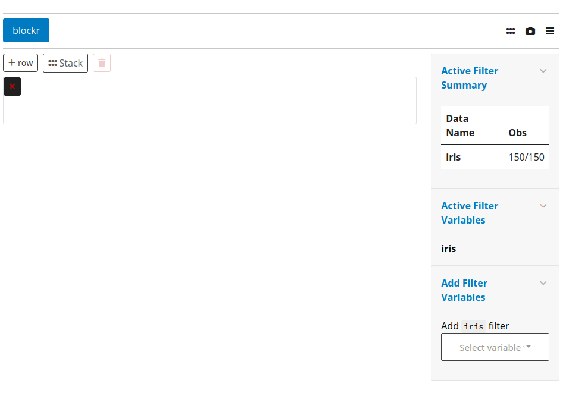

<!-- badges: start -->
<!-- badges: end -->

# blockr.teal

Blockr teal module.

## Installation

You can install the development version of blockr.teal like so:

``` r
# install.packages("remotes")
remotes::install_github("blockr-org/blockr.teal")
```

## Example

``` r
library(blockr.teal)
library(teal)

options("teal.bs_theme" = bslib::bs_theme(5L))

app <- init(
  data = teal_data(iris = iris, cars = cars),
  modules = list(
    blockr_module()
  )
)

shinyApp(app$ui, app$server)
```


